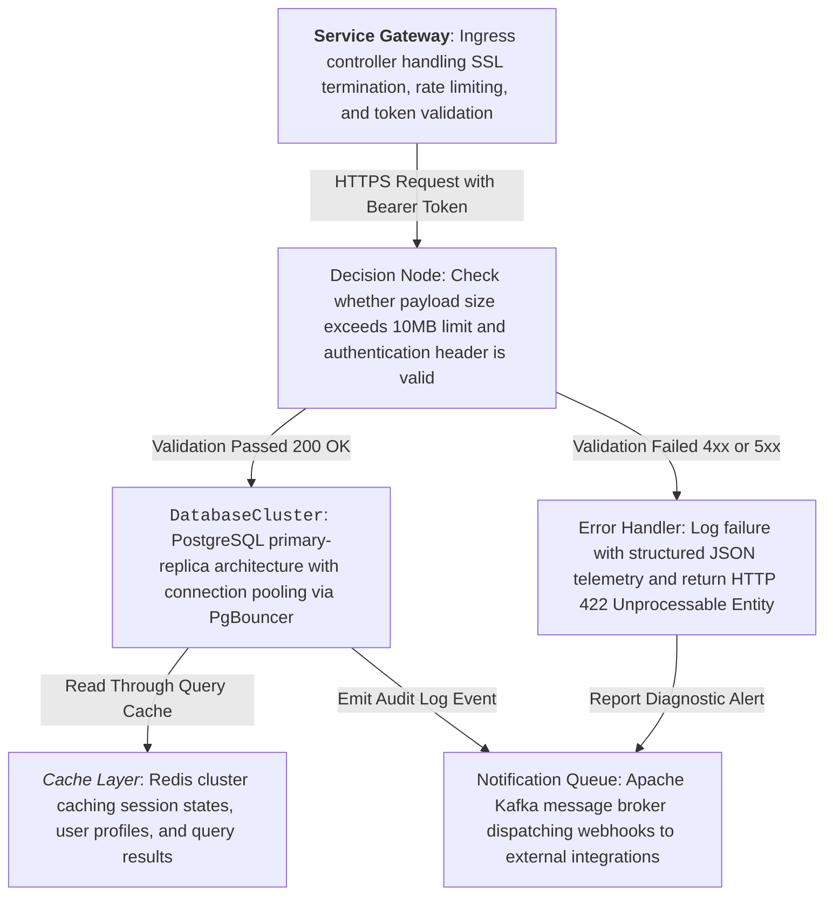

# Long Labels & Complex Formatting Fixture

```mermaid
flowchart TD
  N1["<b>Service Gateway</b>: Ingress controller handling SSL termination, rate limiting, and token validation"]
  N2["<code>DatabaseCluster</code>: PostgreSQL primary-replica architecture with connection pooling via PgBouncer"]
  N3["<i>Cache Layer</i>: Redis cluster caching session states, user profiles, and query results"]
  N4["Decision Node: Check whether payload size exceeds 10MB limit and authentication header is valid"]
  N5["Error Handler: Log failure with structured JSON telemetry and return HTTP 422 Unprocessable Entity"]
  N6["Notification Queue: Apache Kafka message broker dispatching webhooks to external integrations"]

  N1 -->|HTTPS Request with Bearer Token| N4
  N4 -->|Validation Passed 200 OK| N2
  N4 -->|Validation Failed 4xx or 5xx| N5
  N2 -->|Read Through Query Cache| N3
  N2 -->|Emit Audit Log Event| N6
  N5 -->|Report Diagnostic Alert| N6
```
