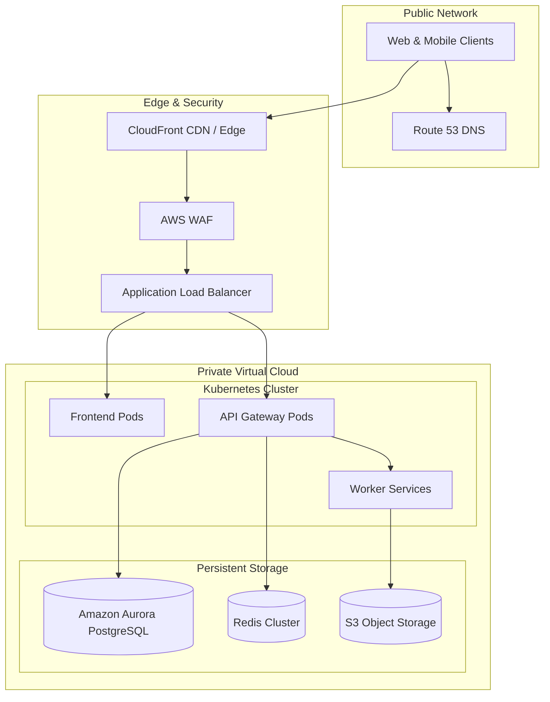

```mermaid
flowchart TD
  subgraph Public [Public Network]
    Users[Web & Mobile Clients]
    DNS[Route 53 DNS]
  end
  
  subgraph Edge [Edge & Security]
    WAF[AWS WAF]
    CloudFront[CloudFront CDN / Edge]
    ALB[Application Load Balancer]
  end
  
  subgraph VPC [Private Virtual Cloud]
    subgraph EKS [Kubernetes Cluster]
      Pod1[Frontend Pods]
      Pod2[API Gateway Pods]
      Pod3[Worker Services]
    end
    
    subgraph Storage [Persistent Storage]
      Aurora[(Amazon Aurora PostgreSQL)]
      ElastiCache[(Redis Cluster)]
      S3[(S3 Object Storage)]
    end
  end
  
  Users --> DNS
  Users --> CloudFront
  CloudFront --> WAF
  WAF --> ALB
  ALB --> Pod1
  ALB --> Pod2
  Pod2 --> Pod3
  Pod2 --> Aurora
  Pod2 --> ElastiCache
  Pod3 --> S3
```
