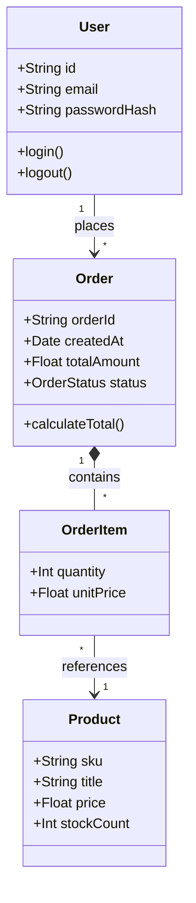

```mermaid
classDiagram
  class User {
    +String id
    +String email
    +String passwordHash
    +login()
    +logout()
  }
  class Order {
    +String orderId
    +Date createdAt
    +Float totalAmount
    +OrderStatus status
    +calculateTotal()
  }
  class OrderItem {
    +Int quantity
    +Float unitPrice
  }
  class Product {
    +String sku
    +String title
    +Float price
    +Int stockCount
  }

  User "1" --> "*" Order : places
  Order "1" *-- "*" OrderItem : contains
  OrderItem "*" --> "1" Product : references
```
