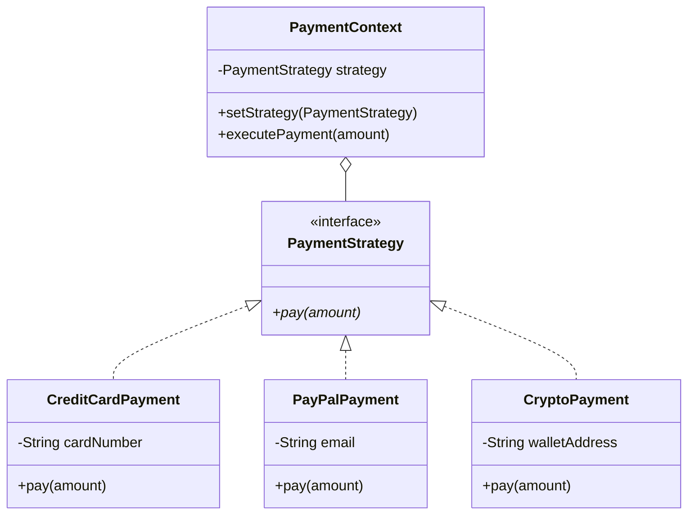

```mermaid
classDiagram
  class PaymentContext {
    -PaymentStrategy strategy
    +setStrategy(PaymentStrategy)
    +executePayment(amount)
  }
  class PaymentStrategy {
    <<interface>>
    +pay(amount)*
  }
  class CreditCardPayment {
    -String cardNumber
    +pay(amount)
  }
  class PayPalPayment {
    -String email
    +pay(amount)
  }
  class CryptoPayment {
    -String walletAddress
    +pay(amount)
  }

  PaymentContext o-- PaymentStrategy
  PaymentStrategy <|.. CreditCardPayment
  PaymentStrategy <|.. PayPalPayment
  PaymentStrategy <|.. CryptoPayment
```
