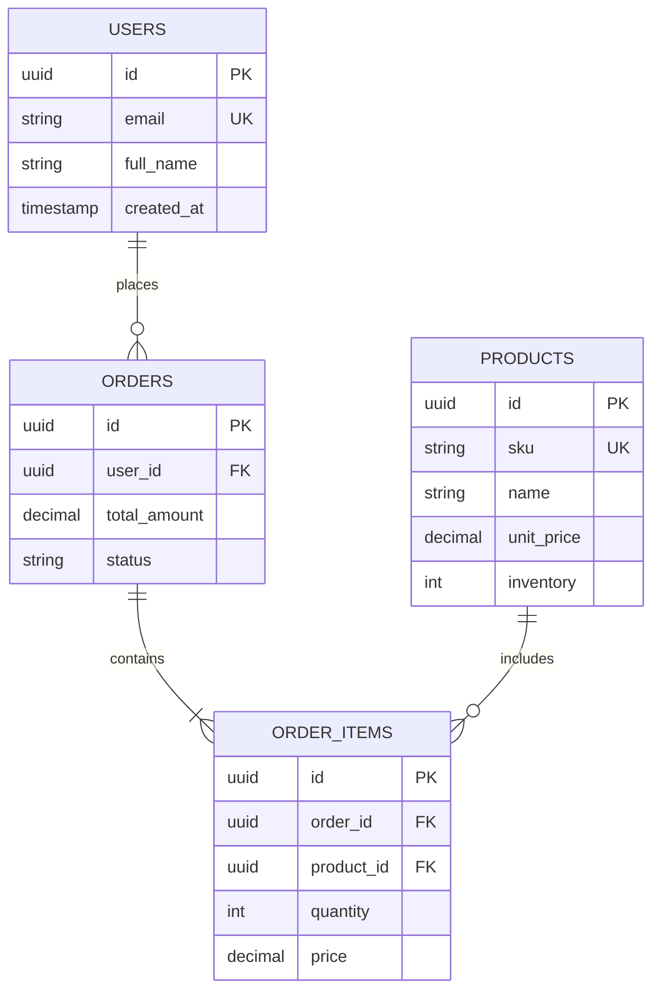

```mermaid
erDiagram
  USERS ||--o{ ORDERS : places
  USERS {
    uuid id PK
    string email UK
    string full_name
    timestamp created_at
  }
  ORDERS ||--|{ ORDER_ITEMS : contains
  ORDERS {
    uuid id PK
    uuid user_id FK
    decimal total_amount
    string status
  }
  PRODUCTS ||--o{ ORDER_ITEMS : includes
  PRODUCTS {
    uuid id PK
    string sku UK
    string name
    decimal unit_price
    int inventory
  }
  ORDER_ITEMS {
    uuid id PK
    uuid order_id FK
    uuid product_id FK
    int quantity
    decimal price
  }
```
