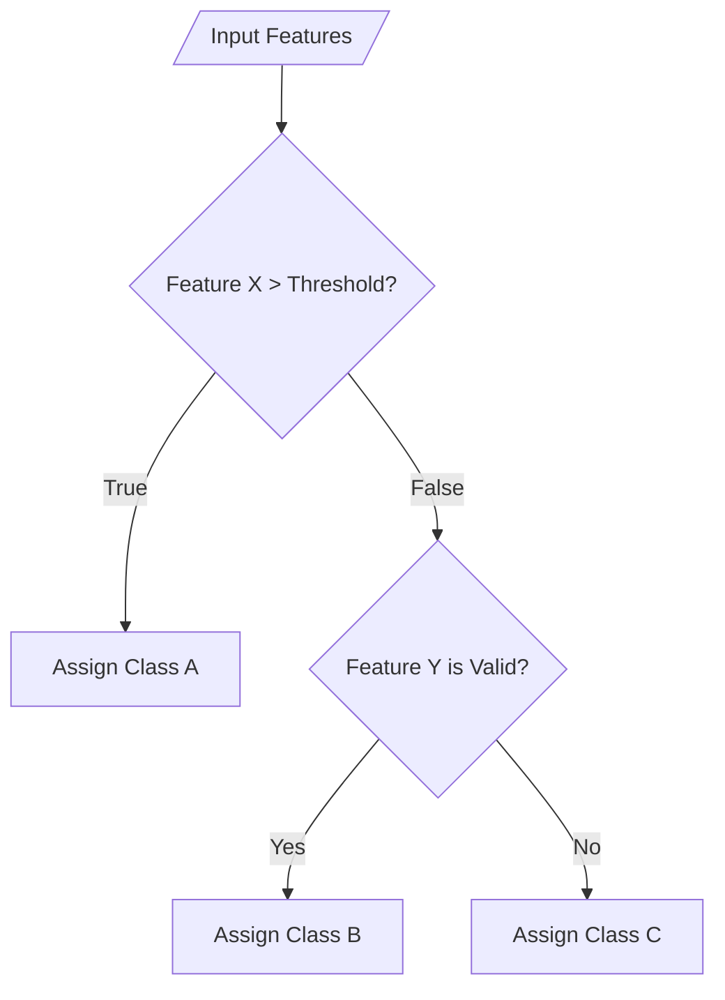

```mermaid
flowchart TD
  Input[/Input Features/] --> ConditionA{Feature X > Threshold?}
  ConditionA -->|True| Leaf1[Assign Class A]
  ConditionA -->|False| ConditionB{Feature Y is Valid?}
  ConditionB -->|Yes| Leaf2[Assign Class B]
  ConditionB -->|No| Leaf3[Assign Class C]
```
