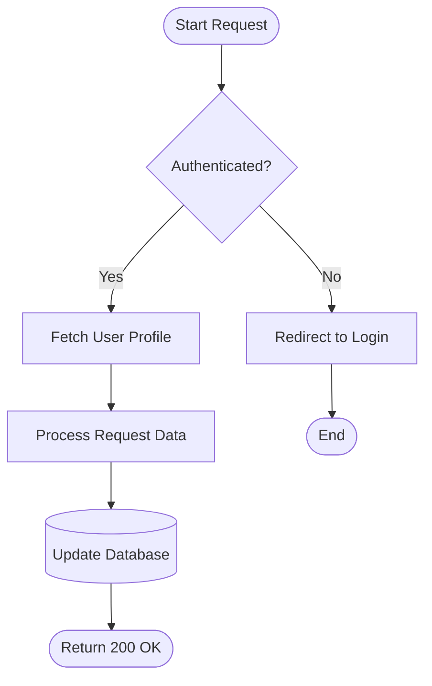

```mermaid
flowchart TD
  Start([Start Request]) --> Auth{Authenticated?}
  Auth -->|Yes| Fetch[Fetch User Profile]
  Auth -->|No| Login[Redirect to Login]
  Fetch --> Process[Process Request Data]
  Process --> DB[(Update Database)]
  DB --> Success([Return 200 OK])
  Login --> Finish([End])
```
