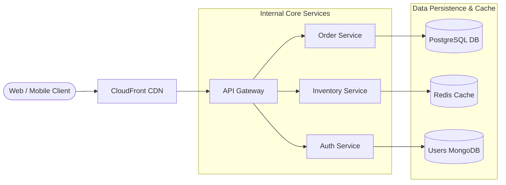

```mermaid
flowchart LR
  Client([Web / Mobile Client]) --> CDN[CloudFront CDN]
  CDN --> Gateway[API Gateway]
  
  subgraph Services [Internal Core Services]
    Gateway --> AuthSvc[Auth Service]
    Gateway --> OrderSvc[Order Service]
    Gateway --> InventorySvc[Inventory Service]
  end
  
  subgraph DataLayer [Data Persistence & Cache]
    OrderSvc --> OrderDB[(PostgreSQL DB)]
    InventorySvc --> Redis[(Redis Cache)]
    AuthSvc --> UserDB[(Users MongoDB)]
  end
```
