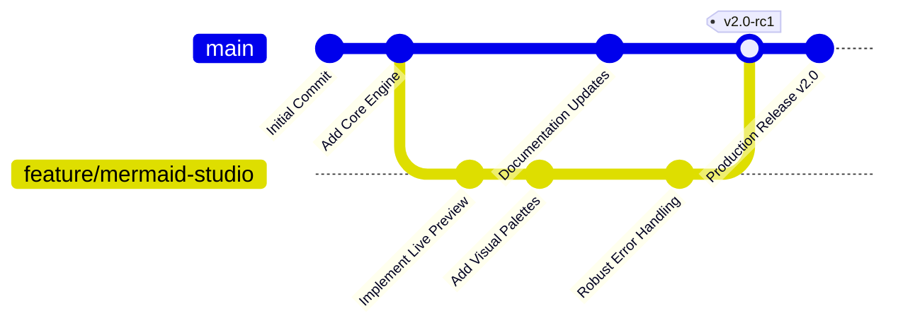

```mermaid
gitGraph
  commit id: "Initial Commit"
  commit id: "Add Core Engine"
  branch feature/mermaid-studio
  checkout feature/mermaid-studio
  commit id: "Implement Live Preview"
  commit id: "Add Visual Palettes"
  checkout main
  commit id: "Documentation Updates"
  checkout feature/mermaid-studio
  commit id: "Robust Error Handling"
  checkout main
  merge feature/mermaid-studio tag: "v2.0-rc1"
  commit id: "Production Release v2.0"
```
