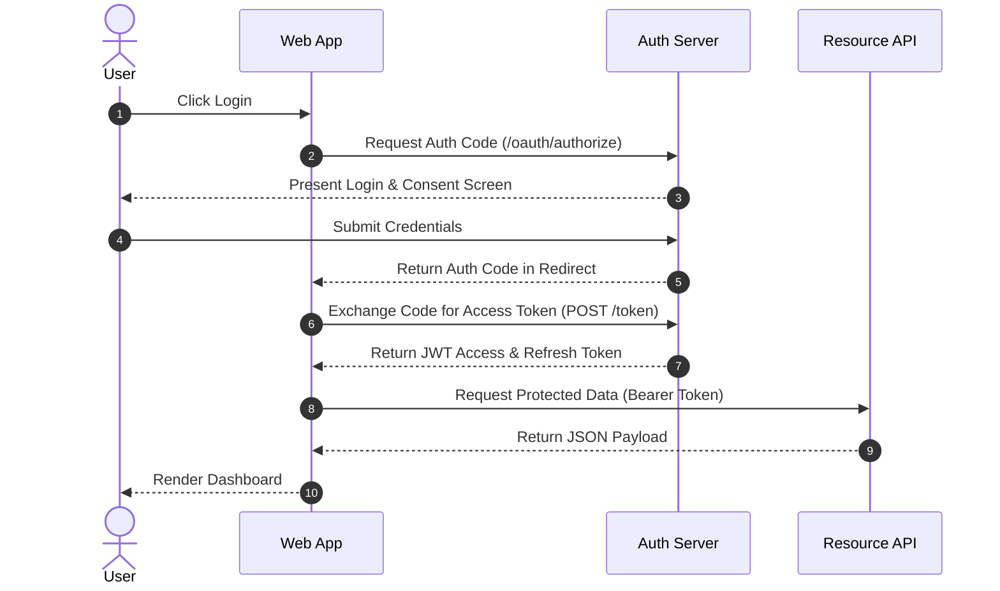

```mermaid
sequenceDiagram
  autonumber
  actor User
  participant Client as Web App
  participant Auth as Auth Server
  participant API as Resource API

  User->>Client: Click Login
  Client->>Auth: Request Auth Code (/oauth/authorize)
  Auth-->>User: Present Login & Consent Screen
  User->>Auth: Submit Credentials
  Auth-->>Client: Return Auth Code in Redirect
  Client->>Auth: Exchange Code for Access Token (POST /token)
  Auth-->>Client: Return JWT Access & Refresh Token
  Client->>API: Request Protected Data (Bearer Token)
  API-->>Client: Return JSON Payload
  Client-->>User: Render Dashboard
```
