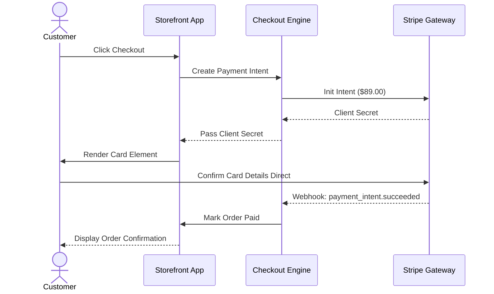

```mermaid
sequenceDiagram
  actor Customer
  participant Shop as Storefront App
  participant Engine as Checkout Engine
  participant Stripe as Stripe Gateway
  
  Customer->>Shop: Click Checkout
  Shop->>Engine: Create Payment Intent
  Engine->>Stripe: Init Intent ($89.00)
  Stripe-->>Engine: Client Secret
  Engine-->>Shop: Pass Client Secret
  Shop->>Customer: Render Card Element
  Customer->>Stripe: Confirm Card Details Direct
  Stripe-->>Engine: Webhook: payment_intent.succeeded
  Engine->>Shop: Mark Order Paid
  Shop-->>Customer: Display Order Confirmation
```
